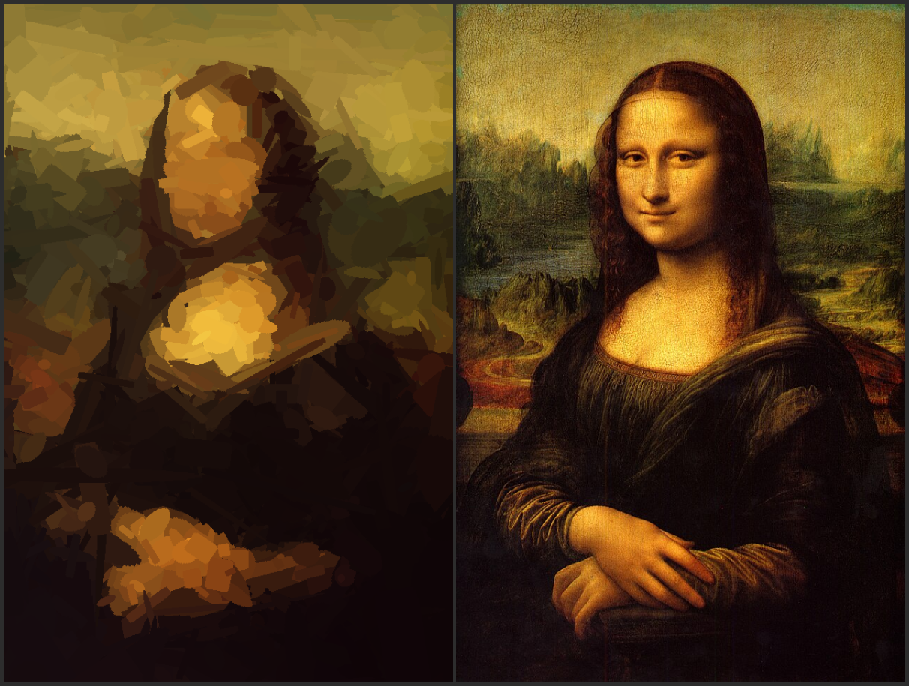
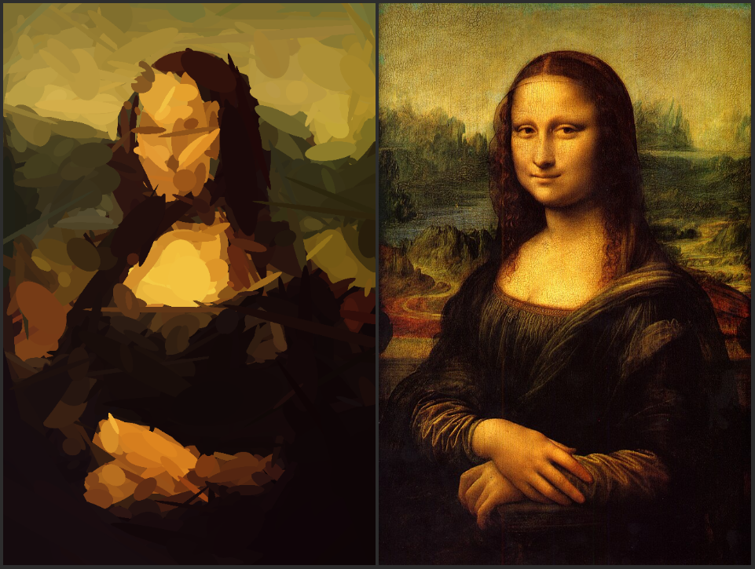

# GeneticArt

Image generation with genetic algorithms

### First render

First render with 2000 objects took 2 minutes and 47 seconds. The genetic algorithm has not been implemented yet. For each object, 100 candidates are tested. Each candidate is evaluated using the mean squared error in the CIELab color space, and the best-performing candidate is selected.

### Masked color sampling

Each candidate determines its color by sampling the target texture within its bounding box, which accelerates the image generation process. However, this approach encounters a significant issue when working with textures that include transparency. Sampling the entire bounding box incorporates pixels into the average color calculation that may not be visible due to the candidate texture's transparency.

To address this, masked color sampling is used. This technique calculates the average color only from the candidate texture's pixels where the alpha channel is not zero.

As shown in the image, this method produces a sharper result compared to the initial render, preserving more details. Additionally, the colors are noticeably more accurate.
